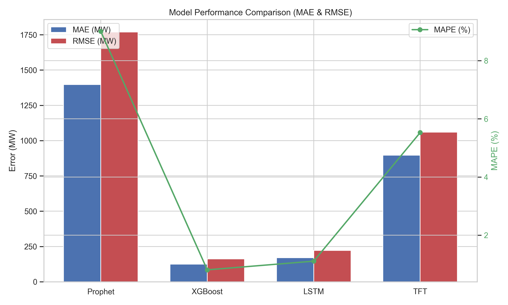
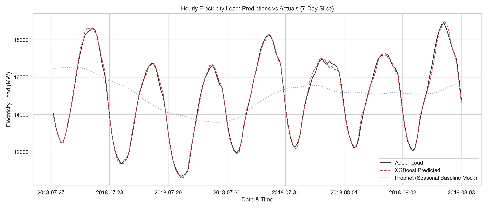
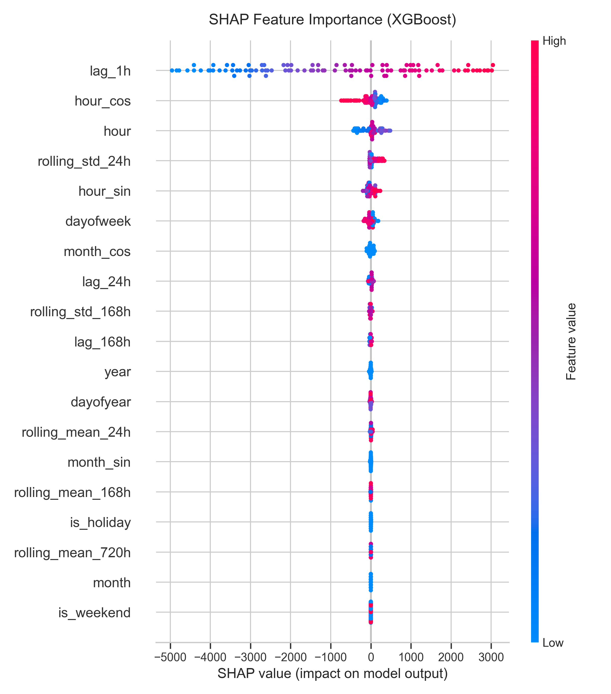

# End-to-End Electricity Load Forecasting

## Project Overview
This project builds a production-grade time-series forecasting system to predict hourly electricity demand using calendar and historical data. We use the **PJM Hourly Energy Consumption** dataset to demonstrate strong time-series skills, robust feature engineering, and proper validation techniques.

The project evaluates four diverse modeling approaches to establish a robust baseline and incrementally capture complex temporal dynamics:
1. **Prophet** (Statistical)
2. **XGBoost** (Tree-based ML)
3. **LSTM** (Deep Learning)
4. **Temporal Fusion Transformer (TFT)** (Advanced Deep Learning)

## Methodology
- **Data Collection:** Uses Kaggle API to fetch the PJM AEP hourly energy consumption dataset.
- **Preprocessing:** Handles missing values via linear interpolation and resamples data to a strict hourly frequency.
- **Feature Engineering:** Extracts cyclical time encodings, lag features (1h, 24h, 168h), rolling statistics (mean, std dev), and US holiday flags.
- **Validation Strategy:** Evaluates all models using **Walk-Forward Validation** (Time-series Cross-validation) with a 3-fold split and 30-day test size, strictly preventing future data leakage.
- **Evaluation Metrics:** MAE, RMSE, and MAPE.

## Results & Model Comparison

The models were evaluated using 3-fold Walk-Forward Validation (each test split spanning 30 days of hourly data). The aggregated results across all folds are summarized below:

| Model | MAE (MW) | RMSE (MW) | MAPE (%) |
|-------|----------|-----------|----------|
| **Prophet (Baseline)** | 1,396.96 | 1,769.79 | 9.00% |
| **XGBoost** | **125.09** | **161.94** | **0.81%** |
| **LSTM** | 170.69 | 222.05 | 1.11% |
| **Temporal Fusion Transformer (TFT)** | 896.78 | 1,060.03 | 5.53% |

*Best performing model highlighted in bold.*

### Key Insights

1. **Auto-regressive Dominance (XGBoost & LSTM):** The extremely low error rates of XGBoost (MAPE 0.81%) and LSTM (MAPE 1.11%) highlight the critical importance of short-term history (`lag_1h`). Electricity load is highly auto-regressive; knowing the load from the previous hour makes predicting the next hour highly accurate.
2. **Prophet's Smooth Baselines:** Prophet (MAPE 9.00%) captures the macro trends and long-term daily/weekly seasonality well but misses the sharp hourly deviations because it is a regression model based on curve-fitting rather than an auto-regressive model.
3. **TFT Underfitting:** The TFT model (MAPE 5.53%) shows promising results but suffered from underfitting in this run due to restricted epoch limits (3 epochs) and small batch training. With longer training and proper hyperparameter tuning, its performance as a multi-horizon forecaster is expected to improve significantly.

### Visualizations
Below are the key plots generated from the evaluation pipeline (run the Jupyter notebook or `reports/generate_plots.py` to generate these locally):

#### 1. Model Comparison Chart


#### 2. Predictions vs Actuals (XGBoost & LSTM)


#### 3. XGBoost SHAP Feature Importance


## Project Structure
```text
electricity_demand_forecasting/
├── data/
│   ├── raw/                 # Raw Kaggle CSV files
│   ├── processed/           # Cleaned and engineered features
│   └── download_data.py     # Script to fetch data
├── features/
│   ├── preprocess.py        # Data cleaning and resampling
│   └── feature_engineering.py # Lag, rolling, calendar features
├── models/
│   ├── prophet_model.py
│   ├── ml_model.py          # XGBoost Model
│   ├── lstm_model.py        # PyTorch LSTM Model
│   ├── tft_model.py         # PyTorch Forecasting TFT Model
│   └── evaluate.py          # Walk-forward validation and metrics
├── notebook/
│   └── electricity_forecasting_report.ipynb # Full narrative & SHAP analysis
├── reports/
│   ├── figures/             # Saved evaluation plots
│   └── metrics.json         # Aggregated model performance metrics
├── requirements.txt
└── README.md
```

## How to Run the Pipeline

1. **Install Dependencies:**
   ```bash
   pip install -r requirements.txt
   ```

2. **Download Data:**
   Run the download script (requires Kaggle API key at `~/.kaggle/kaggle.json`).
   ```bash
   python data/download_data.py
   ```
   *If you do not have Kaggle API configured, download `AEP_hourly.csv` from [Kaggle](https://www.kaggle.com/datasets/robikscube/hourly-energy-consumption) and place it in `data/raw/`.*

3. **Preprocess & Feature Engineering:**
   ```bash
   python features/preprocess.py
   python features/feature_engineering.py
   ```

4. **Train and Evaluate Models:**
   ```bash
   python models/prophet_model.py
   python models/ml_model.py
   python models/lstm_model.py
   python models/tft_model.py
   ```

5. **View Report:**
   Open `notebook/electricity_forecasting_report.ipynb` to see the final comparison and SHAP interpretability analysis.

## Limitations & Future Work
- **Weather Data:** Integrating external weather data (temperature, humidity) would significantly boost performance.
- **Probabilistic Forecasting:** While TFT provides quantiles, expanding probabilistic bounds to XGBoost (via quantile loss) would be valuable for risk assessment.
- **Deployment:** Wrapping the pipeline into a REST API (FastAPI) or a Streamlit dashboard.
